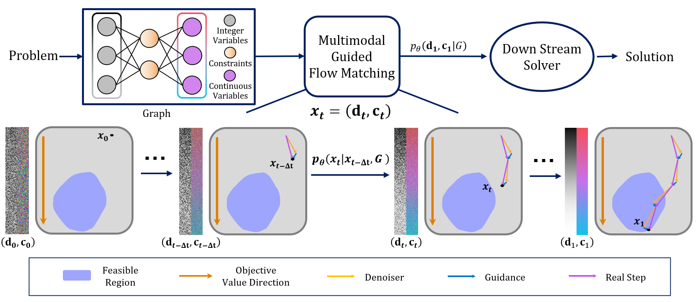

# FMIP: Multimodal Flow Matching for Mixed Integer Linear Programming

This repository is the official implementation of the paper  
[**FMIP: Multimodal Flow Matching for Mixed Integer Linear Programming**](http://arxiv.org/abs/2507.23390).

## Repo Structure
- `downstream/` — implementation of downstream solvers mentioned in the paper  
- `fmip/` — core functions of the proposed FMIP method  
- `train_scripts/` — Bash scripts for training models on different datasets  
- `checkpoints/` — model checkpoint files for each dataset (links to be updated)
